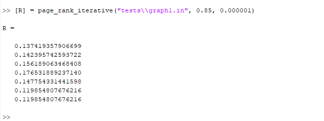
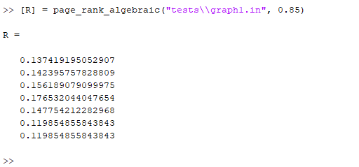
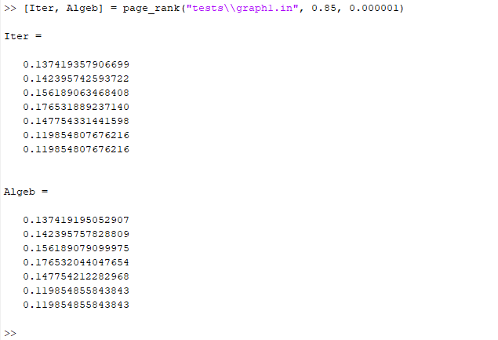
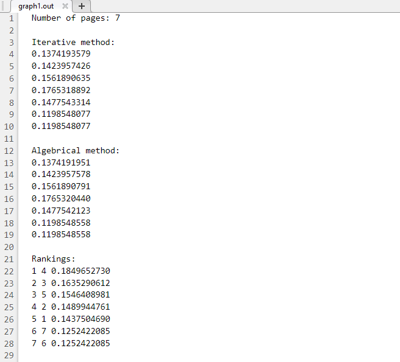
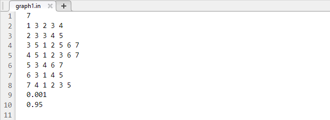

# page-rank
Minimalist implementation in Matlab of "Page Rank" algorithm for hyperlinks analysis from Internet

## **Getting Started**

PageRank is an Internet hyperlink analysis algorithm used by the Google search engine to assign a weight to each element in a set of documents interconnected by hyperlinks, with the aim of measuring relative importance within the set.

Here you can find more informations about [Page Rank](https://en.wikipedia.org/wiki/PageRank).

The "page-rank" project tries to implement the Page Rank algorithm usign two methods:

* Iterative method - you should send a tolerance to calculate the Page Rank vector
* Algebrical method - using limits and convergence we can calculate directly the page rank vector.

### **Using the functions**

For getting the iterative solution you should run in MATLAB's console:

The input params are:

* filename - The name of the file where the hyperlink matrix is found
* damping factor - usually it is 0.85 but you can try any other value < 1
* eps - the tolerance to calculate the page rank answer

For **getting** the algebrical solution you shoul run in MATLAB;s console:

The input params are the same as **page_rank_iterative** however you should not insert a tolerance value because the page rank is calculated using algebrical methods not iterative loops.

In order to compute both solutions and to get a ranking of pages and to calculate their belonging grade you should run in MATLAB's console:

The input params are like **page_rank_iterative**.

After running the above command you will get an output file with the same **name** (not path) as the input filename in your current working folder (Where the project is located).

### **Using the project**

If you want to use the project outside the git folder you must **copy** all source files (*.m) from the **src** folder of the project (you must not include the **tests** folder) and to put them all together in another folder for you to use later.

### **Writing the inputs**

One example of a good input file for the page rank functions is:

First number from the file represents **the number of pages** (rows of the matrix).

Then on the following **pages number** lines we will have the following format:

* First it is the parent page, or the page that have references in another files.
* Second number represents the number of hyperlinks that the parent page contains.
* The following numbers are the hyprlink to another parent pages.

After reading the matrix of hyperlinks, we will have the:

* param1 and param2 needed to find the belongign grade of a page (computing the fuzzy function)

### **Have fun**